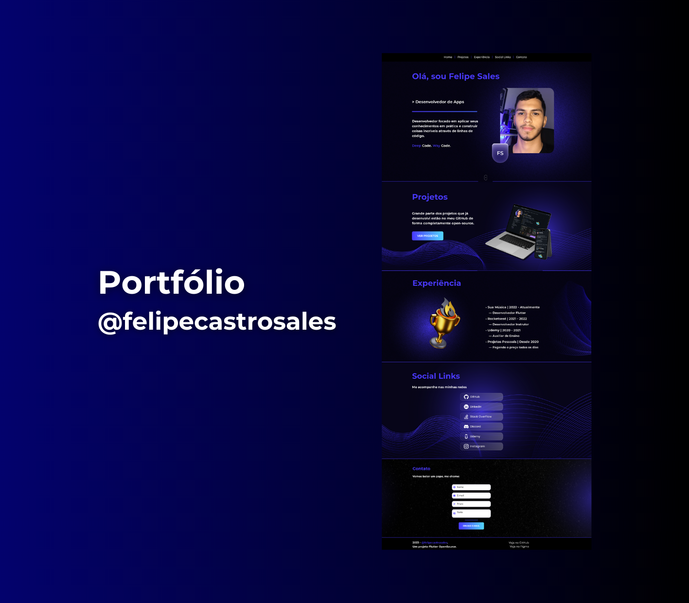

<h1 align="center"><a href="https://felipecastrosales.com">My Portfolio 🔥</a></h1>

---

## 📋 Topics

- [📋 Topics](#-topics)
- [📋 About](#-about)
- [🎨 Layout](#-layout)
- [🚀 Technologies and Tools](#-technologies-and-tools)
- [🤯 Challenges and Learnings](#-challenges-and-learnings)
- [🤔 How to Use](#-how-to-use)
- [🤩 Want to do](#-want-to-do)
- [🤝 Contributing](#-contributing)
- [📝 License](#-license)

---

## 📋 About

With a single codebase, you can access this example from mobile, web and even desktop.

I'm sure this will be one of the best examples of the Flutter Web project in a completely open-source way and with the amout of features that exist.

---

## 🎨 Layout

      You can access the website at <a href="https://felipecastrosales.com">felipecastrosales.com</a> and see the result of the project; it is adapted for mobiles, tablets and desktops. 

   

      
   

   

      The layout was developed by <a href="https://www.instagram.com/karoldepaulasm/">Karol de Paula</a> and me, and you can access it on <a href="https://www.figma.com/file/Dgq4C5dLgtWK2sb0KebmEZ/%40felipecastrosales---Portfolio?type=design&node-id=0%3A1&mode=design&t=RTugDZN5S2knn3Nk-1">Figma</a>.
   

---

## 🚀 Technologies and Tools

- Extremely Responsive Design using [`LayoutBuilder`](https://api.flutter.dev/flutter/widgets/LayoutBuilder-class.html) and other various strategies;
- Dependency Injection with [`GetIt`](https://pub.dev/packages/get_it);
- Use of [`scrollable_positioned_list`](https://pub.dev/packages/scrollable_positioned_list) to perform the "scroll to index" feature;
- Fancy and custom pre-load, using HTML and CSS;
- Firebase ecosystem:
  - [`firebase_analytics`](https://pub.dev/packages/firebase_analytics);
  - [`firebase_core`](https://pub.dev/packages/firebase_core);
  - [`firebase_remote_config`](https://pub.dev/packages/firebase_remote_config);
  - [`firebase_core_platform_interface`](https://pub.dev/packages/firebase_core_platform_interface) - for tests.
- Tests:
  - Unitary, Widgets and Integration Test;
  - The current coverage is 79.5% (PRs are welcome to increase this value);
  - All of them using [`mocktail`](https://pub.dev/packages/mocktail).
- Internationalization:
  - With support to 3 languages: English, Portuguese and Spanish;
- Feature to send an email to the user using [`emailjs API`](https://www.emailjs.com/);
- Settings:
  - Firebase Hosting;
  - Google Domains;
  - Google Analytics;
  - Firebase Remote Config.
- Use of good practices in general, such as:
  - [`Clean Code`](https://www.google.com/search?q=Clean+Code+book&rlz=1C5CHFA_enBR1041BR1041&sxsrf=AJOqlzWiUKnodTrErtwjEw0mr60aKlAQ9A%3A1679360561304&ei=MQIZZICZEpDM1sQPqrSdsAI&ved=0ahUKEwjA9dLN6ev9AhUQppUCHSpaByYQ4dUDCA8&uact=5&oq=Clean+Code+book&gs_lcp=Cgxnd3Mtd2l6LXNlcnAQAzIFCC4QgAQyBQgAEIAEMgYIABAHEB4yBggAEAcQHjIGCAAQBxAeMgYIABAHEB4yBggAEAcQHjIICAAQBxAeEAoyBggAEAcQHjIGCAAQBxAeOgoIABBHENYEELADOgcIABCwAxBDOg0IABDkAhDWBBCwAxgBOgwILhDIAxCwAxBDGAJKBAhBGABQnQZYnQZg7wdoAXABeACAAaMBiAGjAZIBAzAuMZgBAKABAqABAcgBEcABAdoBBggBEAEYCdoBBggCEAEYCA&sclient=gws-wiz-serp);
  - [`Clean Architecture`](https://www.google.com/search?q=Clean+Architecture+book&rlz=1C5CHFA_enBR1041BR1041&sxsrf=AJOqlzWTbx1VkaRMx9Y0pkUmhUFVrdPbew%3A1679360551842&ei=JwIZZKnyMuLf1sQP0-y2MA&ved=0ahUKEwjpoZHJ6ev9AhXir5UCHVO2DQYQ4dUDCA8&uact=5&oq=Clean+Architecture+book&gs_lcp=Cgxnd3Mtd2l6LXNlcnAQAzIFCC4QgAQyCAgAEIAEEMsBMggIABCABBDLATIICAAQgAQQywEyCAgAEIAEEMsBMggIABCABBDLATIGCAAQFhAeMgYIABAWEB4yBggAEBYQHjIGCAAQFhAeOgoIABBHENYEELADOgcIABCwAxBDOgUIABCABEoECEEYAFC5BVi2CmC4DGgCcAF4AIABnwGIAeAEkgEDMC40mAEAoAEByAEJwAEB&sclient=gws-wiz-serp);
  - [`SOLID principles`](https://www.google.com/search?q=SOLID+principles&rlz=1C5CHFA_enBR1041BR1041&oq=SOLID+principles&aqs=chrome..69i57j69i60j69i61.152j0j4&sourceid=chrome&ie=UTF-8);
  - [`Naming Cheatsheet`](https://github.com/kettanaito/naming-cheatsheet);
  - [`dart_code_metrics`](https://pub.dev/packages/dart_code_metrics) - for code analysis;
  - [`flutter_lints`](https://pub.dev/packages/flutter_lints) - for linting.
- CI / CD configurations inside [`workflows` folder](.github/workflows/).
- Among other various packages and internal resources. 🔥

---

## 🤯 Challenges and Learnings

Challenges are always an opportunity for growth, and in this project that became even more real. Making something from scratch, where development was perfected from start to finish - with lots of continual tweaks, for the better. One of the main ones was precisely to adjust all these behaviours for the most varied platforms, to work with breakpoints and to guarantee the best UI and UX for the project.

One thing I realized was that Flutter Web still has a lot to evolve, but id does very well it proposes ([see here](https://docs.flutter.dev/development/platform-integration/web/faq#what-scenarios-are-ideal-for-flutter-on-the-web)). One of the main ones that still annoys me a little is the loading and rendering speed of the elements (there are some pre-load strategies, but that could be better and clearer IMHO.

I feel that the project can evolve a lot, and for that reason I was very carefull with its development. For it to be simple, scalable and capable of any developer, of any level, being able to use and understand it. Also, I'll always be on the lookout for issues and PRs to improve it. 🚀

This project took me out of my comfort zone, and I'm very happy with the result. Also, releasing it to the community did me a lot of good. Let's grow together, because the **Forge is Daily**. 🏆

---

## 🤔 How to Use

First of all, configure the Flutter development environments, see <https://flutter.dev/docs/get-started/install>.

- Clone this repository:
`$ git clone https://github.com/felipecastrosales/site`

- Enter in directory:
`$ cd site`

- Open in your favorite editor (e.g. VSCode):
`$ code .`

- For install dependencies:
`$ flutter pub get`

- Run the app:
`$ flutter run`

---

## 🤩 Want to do

If you want to do this project with yours informations and datas, see the [Want To Do](.github/docs/WANTTODO.md).

---

## 🤝 Contributing

- Fork this repository;
- Create a branch with your feature: git checkout -b my-feature;
- Commit your changes: git commit -m 'feat: My new feature';
- Push your branch: git push origin my-feature.
- Make a pull request, describing the changes you made and await approval.
- You can also make suggestions by opening an issue, reporting bugs or requesting new features.

If you plan to contribute even more, see the [Contribution Guide](.github/docs/CONTRIBUTING.md).

If you want to know more about the Contributors section, see the [Contributors](.github/docs/CONTRIBUTORS.md).

See [Changelog](.github/docs/CHANGELOG.md).

---

## 📝 License

   This repository is under MIT license. You can see the <a href="https://github.com/felipecastrosales/site/blob/master/LICENSE">LICENSE</a> file for more details.

---

>This project was developed with ❤️ by **[@Felipe Sales](https://www.linkedin.com/in/felipecastrosales/)**, with [Karol de Paula](https://www.instagram.com/karoldepaulasm/) and [Daniel Duarte](https://www.linkedin.com/in/daniel2d/). My sincere and true thanks.

If it helped you, give ⭐, contribute, it will help me too.

---

