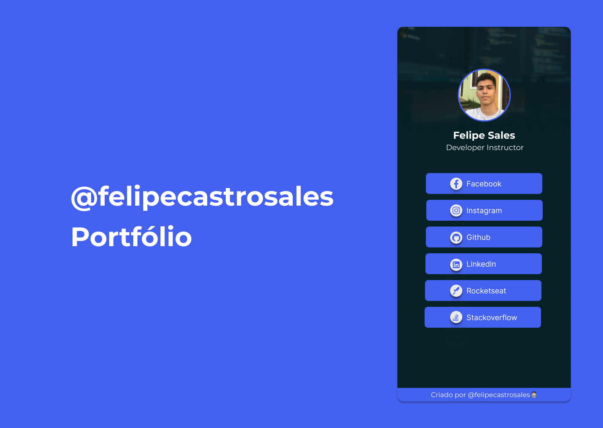

<h1 align="center"><a href="https://felipecastrosales.com">My Website 🔥</a></h1>

---

<h2 align="center">Layout 🎨</h2>

   <p align="center">
      
   </p>

   <p align="center">
      The layout was developed by <a href="https://www.instagram.com/_kaamarketing/">Karol de Paula</a>, and you can access it on <a href="https://www.figma.com/file/kbTqwqaMPLWO9EyPhHI0sl/Felipe-Sales-%7C-Portf%C3%B3lio?node-id=0%3A1">Figma</a>. 🔥
   </p>

---

<h2 align="center">How to Use 🤔</h2>

   ```
   First of all, correctly configure the Flutter development environment on your machine, see https://flutter.dev/docs/get-started/install
   
   - Clone this repository:
   $ git clone https://github.com/felipecastrosales/site

   - Enter in directory:
   $ cd site

   - For install dependencies:
   $ flutter pub get

   - Run the app: 
   $ flutter run
   ```

---

<h2 align="center">License 📝</h2>

<p align="center">
   This repository is under MIT license. You can see the <a href="https://github.com/felipecastrosales/site/blob/master/LICENSE">LICENSE</a> file for more details. 😉
</p>

---

>This project was developed with ❤️ by **[@Felipe Sales](https://www.linkedin.com/in/felipecastrosales/)**, and the designer [Karol de Paula](https://www.behance.net/karolbarroso).<br>
If it helped you, give ⭐, contribute, it will help me too 😉

---

   <div align="center">

   [](https://www.linkedin.com/in/felipecastrosales/)

   </div>
